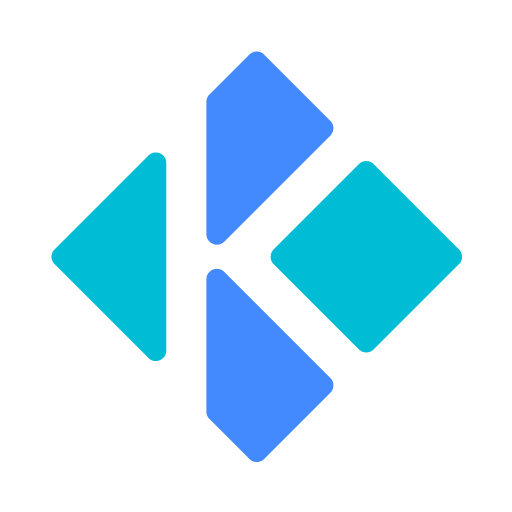
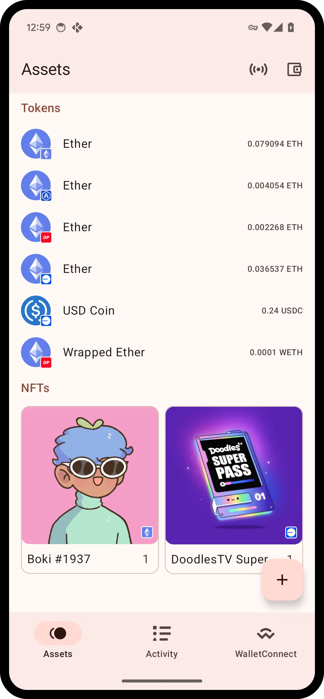
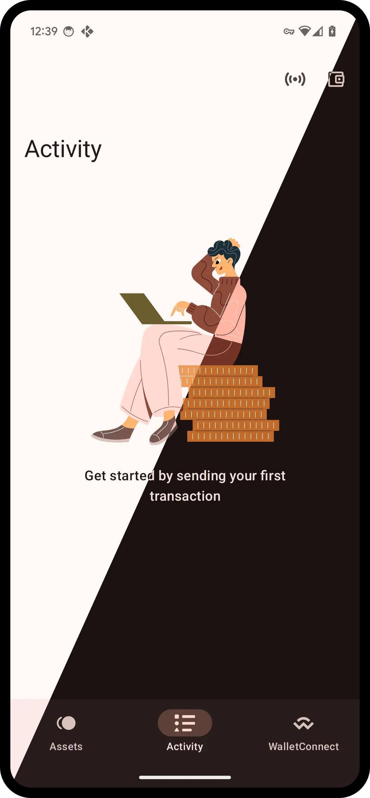

# Kosh

Bridge the gap between your hardware wallet and dapps. Manage your crypto and interact with dapps
from your mobile device.

**Note:** Kosh is currently in development and may be unstable.

## Screenshots

    
    
    
    
    

## Features

- [x] Android
- [x] WalletConnect Sign, Auth
- [x] Trezor Safe 3, Safe 5, T, One
- [x] Link Trezor Passphrase to Biometrics
- [x] Ledger Nano X, Nano S Plus, Stax
- [x] Tokens, NFTs
- [x] Material You design
- [x] IPFS Trustless client
- [x] EIP-191, EIP-712, EIP-1559
- [ ] iOS
- [ ] WalletConnect Inbox
- [ ] EIP-7702
- [ ] ENS
- [ ] Keystone (USB)
- [ ] Export/Import passkeys

## Built With

* [Kotlin Multiplatform](https://github.com/JetBrains/kotlin)
* [Kotlin Compose](https://github.com/JetBrains/compose-multiplatform)
* [Secp256k1](https://github.com/ACINQ/secp256k1-kmp)
* [Decompose](https://github.com/arkivanov/Decompose)
* [Compose ImageLoader](https://github.com/qdsfdhvh/compose-imageloader)
