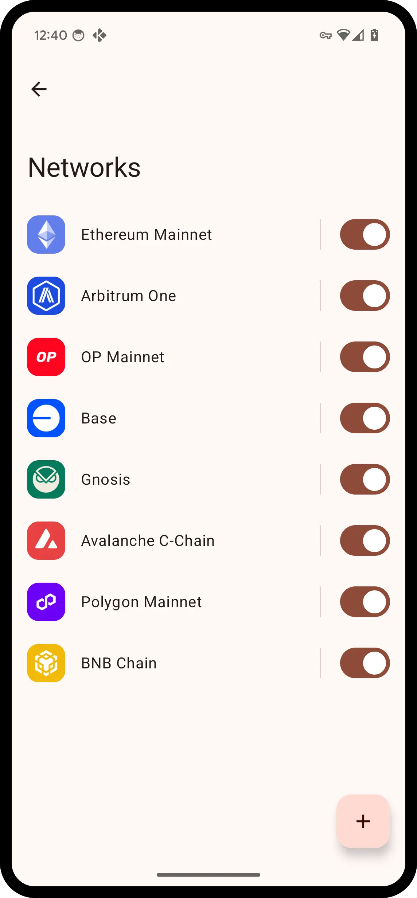
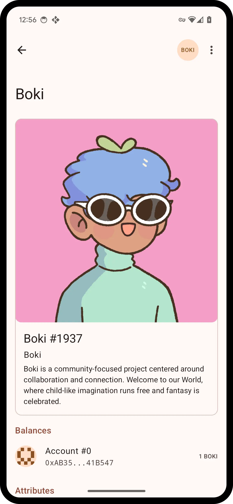
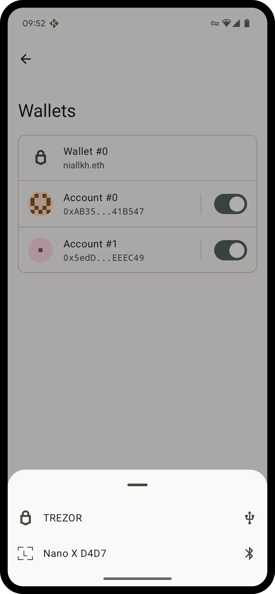

# Kosh

Bridge the gap between your hardware wallet and dapps. Manage your crypto and interact with dapp
from your mobile device.

## Features

Some things you can do now:

* WalletConnect Sign, Auth
* EIP-191, EIP-712, EIP-1559
* Trezor Safe 3, Safe 5, T, One
* Link Trezor Passphrase to Biometrics
* Ledger Nano X, Nano S Plus, Stax (USB)
* NFTs
* Material You design
* IPFS trustless client

## Roadmap

Some things you can expect in the future:

* Export/Import passkeys
* WalletConnect Inbox
* ENS
* Keystone (USB)
* Ledger (Bluetooth)
* iOS

## Built With

* [Kotlin Multiplatform](https://github.com/JetBrains/kotlin)
* [Kotlin Compose](https://github.com/JetBrains/compose-multiplatform)
* [Secp256k1](https://github.com/ACINQ/secp256k1-kmp)
* [Decompose](https://github.com/arkivanov/Decompose) for navigation
* [Compose ImageLoader](https://github.com/qdsfdhvh/compose-imageloader)

## Screenshots

    

        
        
        
        
    

    

        
        
        
        
    

